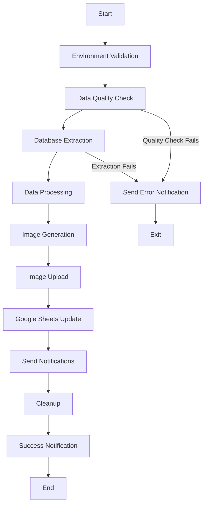

# Google Reporting Bot

An automated business reporting system that extracts data from databases, generates visual reports, and sends notifications through multiple channels including Google Sheets integration and webhook notifications.

## 🚀 Features

- **Data Extraction**: Extract business data from PostgreSQL databases
- **Data Quality Assurance**: Automated quality checks to ensure data integrity
- **Visual Report Generation**: Create charts and images for country and manager-level reporting
- **Google Sheets Integration**: Push data to Google Sheets for collaborative analysis
- **Image Hosting**: Upload generated images to ImgBB and Google Drive
- **Multi-Channel Notifications**: Send reports via webhooks to multiple endpoints
- **Error Handling**: Comprehensive error handling with notification system
- **Automated Cleanup**: Clean up temporary files after processing

## 📁 Project Structure

```
├── main.py                     # Main application entry point
├── requirements.txt            # Python dependencies
├── quality_check.db           # SQLite database for quality checks
├── output/                    # Generated reports and images
├── token/                     # Google API credentials
│   ├── credentials.json
│   ├── personal_credentials.json
│   └── token.json
└── src/
    ├── config/                # Configuration management
    ├── extractor/             # Data extraction modules
    ├── img/                   # Image generation and upload
    ├── message/               # Notification services
    ├── processor/             # Data processing and formatting
    ├── quality_check/         # Data quality validation
    ├── services/              # Business logic services
    └── utils/                 # Utility functions
```

## 🛠️ Installation

1. **Clone the repository**:
   ```bash
   git clone https://github.com/daniel-d7/google_reporting_bot.git
   cd google_reporting_bot
   ```

2. **Install dependencies**:
   ```bash
   pip install -r requirements.txt
   ```

3. **Set up Google API credentials**:
   - Place your Google API credentials in the `token/` directory
   - `credentials.json`: Service account credentials for Google Sheets
   - `personal_credentials.json`: Personal credentials for Google Drive
   - `token.json`: OAuth token file

4. **Configure environment variables**:
   Create a `.env` file in the root directory with the following variables:

   ```env
   # Database Configuration
   DB_HOST=your_database_host
   DB_NAME=your_database_name
   DB_USER=your_database_user
   DB_PASSWORD=your_database_password
   DB_PORT=5432

   # SQL Statements
   SQL_STATEMENT_COUNTRY=your_country_sql_query
   SQL_STATEMENT_MANAGER=your_manager_sql_query
   SQL_STATEMENT_PRDLINE=your_product_line_sql_query
   SQL_QUALITY_CHECK=your_quality_check_sql_query

   # Google Services
   GOOGLE_SHEET_ID=your_google_sheet_id
   GDRIVE_FOLDER_ID=your_google_drive_folder_id
   SHEET_URL=your_google_sheet_url

   # Image Hosting
   IMGBB_API_KEY=your_imgbb_api_key

   # Webhook URLs
   WEBHOOK_URL_SSO=your_sso_webhook_url
   WEBHOOK_URL_CPI=your_cpi_webhook_url
   WEBHOOK_URL_ERROR=your_error_webhook_url
   WEBHOOK_URL_LOGGING=your_logging_webhook_url

   # Optional Paths
   PROJECT_ROOT=/path/to/project
   OUTPUT_DIR=output
   CREDENTIALS_JSON=token/credentials.json
   PERSONAL_CREDENTIALS_JSON=token/personal_credentials.json
   TOKEN_JSON=token/token.json
   ```

## 🚦 Usage

Run the main application:

```bash
python main.py
```

The application will:

1. **Validate Configuration**: Check all required environment variables
2. **Quality Check**: Verify data quality before processing
3. **Extract Data**: Pull data from the database using configured SQL statements
4. **Generate Reports**: Create visual charts for country and manager data
5. **Upload Images**: Host images on ImgBB and Google Drive
6. **Update Google Sheets**: Push product line data to Google Sheets
7. **Send Notifications**: Distribute reports via configured webhooks
8. **Cleanup**: Remove temporary files
9. **Success Notification**: Send completion confirmation

## 📊 Data Flow



## 🔧 Configuration

### Database Connection
The application connects to PostgreSQL databases using SQLAlchemy. Configure your database connection in the `.env` file.

### Google Services
- **Google Sheets API**: For data collaboration and storage
- **Google Drive API**: For image storage and sharing

### Image Hosting
- **ImgBB**: For thumbnail image hosting
- **Google Drive**: For full-resolution image storage

### Notifications
Configure webhook URLs for different notification channels:
- SSO notifications
- CPI notifications
- Error notifications
- Logging notifications

## 📈 Report Types

1. **Country Reports**: Business performance by country
2. **Manager Reports**: Performance metrics by manager
3. **Product Line Data**: Detailed product line analysis in Google Sheets

## 🛡️ Quality Assurance

The application includes comprehensive data quality checks:
- NMV (Net Merchandise Value) validation
- Historical data comparison
- Automatic error reporting
- Data integrity verification

## 🔍 Monitoring

- Real-time quality checks
- Error notification system
- Success/failure logging
- Webhook-based monitoring

## 📝 Logging

The application provides detailed logging for:
- Process execution status
- Error tracking
- Quality check results
- Notification delivery status

## 🤝 Contributing

1. Fork the repository
2. Create a feature branch (`git checkout -b feature/amazing-feature`)
3. Commit your changes (`git commit -m 'Add some amazing feature'`)
4. Push to the branch (`git push origin feature/amazing-feature`)
5. Open a Pull Request

## 📄 License

This project is licensed under the MIT License - see the [LICENSE](LICENSE) file for details.

## 🆘 Support

For support and questions:
- Create an issue in the GitHub repository
- Check the logs for detailed error information
- Verify environment variable configuration

## 🔄 Automation

This bot is designed to run automatically and can be scheduled using:
- **Windows Task Scheduler**
- **Cron jobs** (Linux/macOS)
- **GitHub Actions**
- **Docker containers**

## ⚙️ System Requirements

- Python 3.7+
- PostgreSQL database access
- Google API credentials
- ImgBB API access
- Webhook endpoints for notifications

---

**Note**: Make sure all sensitive credentials are properly secured and never commit them to version control.